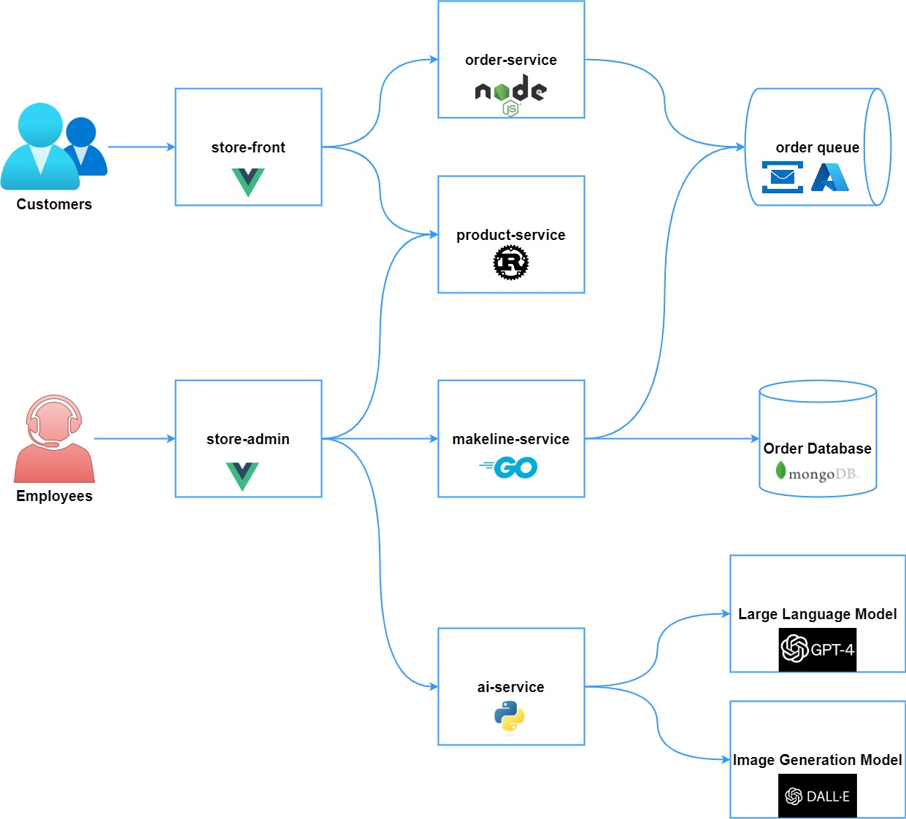

# Bestbuy Store (On Steroids)
Welcome to the Bestbuy Store (On Steroids) application.

This sample demo app consists of a group of containerized microservices that can be easily deployed into a Kubernetes cluster. This is meant to show a realistic scenario using a polyglot architecture, event-driven design, and common open source back-end services (eg - Azure Serviec Bus, MongoDB). The application also leverages OpenAI's models to generate product descriptions and images. This can be done using either [Azure OpenAI](https://learn.microsoft.com/azure/ai-services/openai/overview) or [OpenAI](https://openai.com/).

This application is inspired by Azure Kubernetes Service (AKS) quickstart demo [Azure Kubernetes Service (AKS) Docs](https://learn.microsoft.com/en-us/azure/aks/).

> [!NOTE]
> This is not meant to be an example of perfect code to be used in production, but more about showing a realistic application running in kubernetes. 

## Architecture

The application has the following services: 



The application has the following services: 

| Service | Description | Github Repo |
| --- | --- | --- |
| `store-front` | Web app for customers to place orders (Vue.js) | [store-front-bestbuy](https://github.com/bhun0002/store-front-bestbuy) |
| `store-admin` | Web app used by store employees to view orders in queue and manage products (Vue.js) | [store-admin-bestbuy](https://github.com/bhun0002/store-admin-bestbuy) |
| `order-service` | This service is used for placing orders (Javascript) | [order-service-bestbuy](https://github.com/bhun0002/order-service-bestbuy) |
| `product-service` | This service is used to perform CRUD operations on products (Rust) | [product-service-bestbuy](https://github.com/bhun0002/product-service-bestbuy) |
| `makeline-service` | This service handles processing orders from the queue and completing them (Golang) | [makeline-service-bestbuy](https://github.com/bhun0002/makeline-service-bestbuy) |
| `ai-service` | Optional service for adding generative text and graphics creation (Python) | [ai-service-bestbuy](https://github.com/bhun0002/ai-service-bestbuy) |
| `rabbitmq` | RabbitMQ for an order queue | [rabbitmq](https://github.com/docker-library/rabbitmq) |
| `mongodb` | MongoDB instance for persisted data | [mongodb](https://github.com/docker-library/mongo) |
| `virtual-customer` | Simulates order creation on a scheduled basis (Rust) | [virtual-customer-bestbuy](https://github.com/bhun0002/virtual-customer-bestbuy) |
| `virtual-worker` | Simulates order completion on a scheduled basis (Rust) | [virtual-worker-bestbuy](https://github.com/bhun0002/virtual-worker-bestbuy) |


## Run the app on Azure Kubernetes Service (AKS)

### Fork the Repositories
To get started, you need to fork the following repositories into your own GitHub account. This ensures you have your own working copies to modify and deploy.

Steps to Fork Each Repository:
1. Navigate to the GitHub repository URLs listed above.
2. Click the **Fork** button on the top-right corner of the repository page.
3. Select your GitHub account to fork the repository into your personal account.

After forking, clone each repository to your local machine using the following command:

```bash
git clone https://github.com/<your-username>/store-front-bestbuy.git
git clone https://github.com/<your-username>/store-admin-bestbuy.git
git clone https://github.com/<your-username>/order-service-bestbuy.git
git clone https://github.com/<your-username>/product-service-bestbuy.git
git clone https://github.com/<your-username>/makeline-service-bestbuy.git
git clone https://github.com/<your-username>/ai-service-bestbuy.git
git clone https://github.com/<your-username>/virtual-customer-bestbuy.git
git clone https://github.com/<your-username>/virtual-worker-bestbuy.git

```


### Containerizing the Algonquin Pet Store Microservices
In this step, you will create Dockerfiles for each of the `order-service`, `product-service`, and `store-front`, etc microservices.

#### Dockerize the cloned services

**Navigate to the cloned repositories** 
Once all repositories have been cloned, navigate to each cloned repository and build the Docker image for each service individually.

**Build the Docker image:**
  ```
  docker build -t store-front-bestbuy:latest .
  docker build -t store-admin-bestbuy:latest .
  docker build -t order-service-bestbuy:latest .
  docker build -t product-service-bestbuy:latest .
  docker build -t makeline-service-bestbuy:latest .
  docker build -t ai-service-bestbuy:latest .
  docker build -t virtual-customer-bestbuy:latest .
  docker build -t virtual-worker-bestbuy:latest .
 
  ```

### Pushing Docker Images to a Container Registry
Push the Docker images to a container registry. You can use Docker Hub or Azure Container Registry (ACR). Here we are going to use Docker Hub.

You need to log in to your Docker Hub account before pushing the images:
```bash
docker login
```

#### Tag the images:
  ```
    docker tag ai-service-best-buy:latest <your-dockerhub-username>/ai-service-best-buy:latest 
    docker tag makeline-service-best-buy:latest <your-dockerhub-username>/makeline-service-best-buy:latest 
    docker tag product-service-best-buy:latest <your-dockerhub-username>/product-service-best-buy:latest 
    docker tag store-front-best-buy:latest <your-dockerhub-username>/store-front-best-buy:latest
    docker tag virtual-worker-best-buy:latest <your-dockerhub-username>/virtual-worker-best-buy:latest 
    docker tag order-service-best-buy:latest <your-dockerhub-username>/order-service-best-buy:latest 
    docker tag store-admin-best-buy:latest <your-dockerhub-username>/store-admin-best-buy:latest 
    docker tag virtual-customer-best-buy:latest <your-dockerhub-username>/virtual-customer-best-buy:latest 

  ```

#### Push the images:
  ```
    docker push <your-dockerhub-username>/ai-service-best-buy:latest 
    docker push <your-dockerhub-username>/makeline-service-best-buy:latest 
    ocker push <your-dockerhub-username>/product-service-best-buy:latest 
    docker push <your-dockerhub-username>/store-front-best-buy:latest
    docker push <your-dockerhub-username>/virtual-worker-best-buy:latest 
    docker push <your-dockerhub-username>/order-service-best-buy:latest 
    docker push <your-dockerhub-username>/store-admin-best-buy:latest 
    docker push <your-dockerhub-username>/virtual-customer-best-buy:latest 

  ```

### Optional: Clean Up Docker Environment
After completing the lab, you can clean up your local Docker environment to free up space by removing unused images and containers:

```bash
docker system prune -a
```