# Best Buy Store (On Steroids)
Welcome to the Bestbuy Store (On Steroids) application.

This sample demo app consists of a group of containerized microservices that can be easily deployed into a Kubernetes cluster. This is meant to show a realistic scenario using a polyglot architecture, event-driven design, and common open source back-end services (eg - Rabbit MQ, MongoDB). The application also leverages OpenAI's models to generate product descriptions and images. This can be done using either [Azure OpenAI](https://learn.microsoft.com/azure/ai-services/openai/overview) or [OpenAI](https://openai.com/).

This application is inspired by Azure Kubernetes Service (AKS) quickstart demo [Azure Kubernetes Service (AKS) Docs](https://learn.microsoft.com/en-us/azure/aks/).

> [!NOTE]
> This is not meant to be an example of perfect code to be used in production, but more about showing a realistic application running in kubernetes. 

## Architecture

The application has the following services: 


The application has the following services: 

| Service | Description | Github Repo |
| --- | --- | --- |
| `store-front` | Web app for customers to place orders (Vue.js) | [store-front-bestbuy](https://github.com/bhun0002/store-front-bestbuy) |
| `store-admin` | Web app used by store employees to view orders in queue and manage products (Vue.js) | [store-admin-bestbuy](https://github.com/bhun0002/store-admin-bestbuy) |
| `order-service` | This service is used for placing orders (Javascript) | [order-service-bestbuy](https://github.com/bhun0002/order-service-bestbuy) |
| `product-service` | This service is used to perform CRUD operations on products (Rust) | [product-service-bestbuy](https://github.com/bhun0002/product-service-bestbuy) |
| `makeline-service` | This service handles processing orders from the queue and completing them (Golang) | [makeline-service-bestbuy](https://github.com/bhun0002/makeline-service-bestbuy) |
| `ai-service` | Optional service for adding generative text and graphics creation (Python) | [ai-service-bestbuy](https://github.com/bhun0002/ai-service-bestbuy) |
| `rabbitmq` | RabbitMQ for an order queue | [rabbitmq](https://github.com/docker-library/rabbitmq) |
| `mongodb` | MongoDB instance for persisted data | [mongodb](https://github.com/docker-library/mongo) |
| `virtual-customer` | Simulates order creation on a scheduled basis (Rust) | [virtual-customer-bestbuy](https://github.com/bhun0002/virtual-customer-bestbuy) |
| `virtual-worker` | Simulates order completion on a scheduled basis (Rust) | [virtual-worker-bestbuy](https://github.com/bhun0002/virtual-worker-bestbuy) |


## Run the app on Azure Kubernetes Service (AKS)

### Fork the Repositories
To get started, you need to fork the following repositories into your own GitHub account. This ensures you have your own working copies to modify and deploy.

Steps to Fork Each Repository:
1. Navigate to the GitHub repository URLs listed above.
2. Click the **Fork** button on the top-right corner of the repository page.
3. Select your GitHub account to fork the repository into your personal account.

After forking, clone each repository to your local machine using the following command:

```bash
git clone https://github.com/<your-username>/store-front-bestbuy.git
git clone https://github.com/<your-username>/store-admin-bestbuy.git
git clone https://github.com/<your-username>/order-service-bestbuy.git
git clone https://github.com/<your-username>/product-service-bestbuy.git
git clone https://github.com/<your-username>/makeline-service-bestbuy.git
git clone https://github.com/<your-username>/ai-service-bestbuy.git
git clone https://github.com/<your-username>/virtual-customer-bestbuy.git
git clone https://github.com/<your-username>/virtual-worker-bestbuy.git

```


### Containerizing the Best Buy Store Microservices
In this step, you will create Dockerfiles for each of the `order-service-bestbuy`, `product-service-bestbuy`, and `store-front-bestbuy`, etc microservices.

#### Dockerize the cloned services

**Navigate to the cloned repositories** 
Once all repositories have been cloned, navigate to each cloned repository and build the Docker image for each service individually.

**Build the Docker image:**
  ```
  docker build -t store-front-bestbuy:latest .
  docker build -t store-admin-bestbuy:latest .
  docker build -t order-service-bestbuy:latest .
  docker build -t product-service-bestbuy:latest .
  docker build -t makeline-service-bestbuy:latest .
  docker build -t ai-service-bestbuy:latest .
  docker build -t virtual-customer-bestbuy:latest .
  docker build -t virtual-worker-bestbuy:latest .
 
  ```

### Pushing Docker Images to a Container Registry
Push the Docker images to a container registry. You can use Docker Hub or Azure Container Registry (ACR). Here we are going to use Docker Hub.

You need to log in to your Docker Hub account before pushing the images:
```bash
docker login
```

#### Tag the images:
  ```
    docker tag ai-service-best-buy:latest <your-dockerhub-username>/ai-service-best-buy:latest 
    docker tag makeline-service-best-buy:latest <your-dockerhub-username>/makeline-service-best-buy:latest 
    docker tag product-service-best-buy:latest <your-dockerhub-username>/product-service-best-buy:latest 
    docker tag store-front-best-buy:latest <your-dockerhub-username>/store-front-best-buy:latest
    docker tag virtual-worker-best-buy:latest <your-dockerhub-username>/virtual-worker-best-buy:latest 
    docker tag order-service-best-buy:latest <your-dockerhub-username>/order-service-best-buy:latest 
    docker tag store-admin-best-buy:latest <your-dockerhub-username>/store-admin-best-buy:latest 
    docker tag virtual-customer-best-buy:latest <your-dockerhub-username>/virtual-customer-best-buy:latest 

  ```

#### Push the images:
  ```
    docker push <your-dockerhub-username>/ai-service-best-buy:latest 
    docker push <your-dockerhub-username>/makeline-service-best-buy:latest 
    ocker push <your-dockerhub-username>/product-service-best-buy:latest 
    docker push <your-dockerhub-username>/store-front-best-buy:latest
    docker push <your-dockerhub-username>/virtual-worker-best-buy:latest 
    docker push <your-dockerhub-username>/order-service-best-buy:latest 
    docker push <your-dockerhub-username>/store-admin-best-buy:latest 
    docker push <your-dockerhub-username>/virtual-customer-best-buy:latest 

  ```

### Optional: Clean Up Docker Environment
After completing the lab, you can clean up your local Docker environment to free up space by removing unused images and containers:

```bash
docker system prune -a
```


### Step 1: Clone the Repositories

To begin, clone the [**Best-Buy (On Steroids)**](https://github.com/bhun0002/Best-Buy-Documentation) repository, which contains all necessary deployment files.

 **Review the Deployment Files**:
   - Navigate to the `Deployment Files` folder
   - This folder contains YAML files for deploying all necessary Kubernetes resources, including services, deployments, StatefulSets, ConfigMaps, and Secrets.


### Step 2: Create an Azure Kubernetes Cluster (AKS)

1. **Log in to Azure Portal:**
   - Go to [https://portal.azure.com](https://portal.azure.com) and log in with your Azure account.

2. **Create a Resource Group:**
   - In the Azure Portal, search for **Resource Groups** in the search bar.
   - Click **Create** and fill in the following:
     - **Resource group name**: `BestBuyRG`
     - **Region**: `Canada`.
   - Click **Review + Create** and then **Create**.

3. **Create an AKS Cluster:**
   - In the search bar, type **Kubernetes services** and click on it.
   - Click **Create** and select **Kubernetes cluster**
   - In the `Basics` tap fill in the following details:
     - **Subscription**: Select your subscription.
     - **Resource group**: Choose `BestBuyRGRG`.
     - **Cluster preset configuration**: Choose `Dev/Test`.
     - **Kubernetes cluster name**: `BestBuyRGCluster`.
     - **Region**: Same as your resource group (e.g., `Canada`).
     - **Availability zones**: `None`.
     - **AKS pricing tier**: `Free`.
     - **Kubernetes version**: `Default`.
     - **Automatic upgrade**: `Disabled`.
     - **Automatic upgrade scheduler**: `No schedule`.
     - **Node security channel type**: `None`.
     - **Security channel scheduler**: `No schedule`.
     - **Authentication and Authorization**: `Local accounts with Kubernetes RBAC`.
   - In the `Node pools` tap fill in the following details:
     - Select **agentpool**. Optionally change its name to `masterpool`. This nodes will have the controlplane.
        - Set **node size** to `D2as_v4`.
        - **Scale method**: `Manual`
        - **Node count**: `1`
        - Click `update`
     - Click on **Add node pool**:
        - **Node pool name**: `workerspool`.
        - **Mode**: `User` 
        - Set **node size** to `D2as_v4`.
        - **Scale method**: `Manual`
        - **Node count**: `2`
        - Click `add`
   - Click **Review + Create**, and then **Create**. The deployment will take a few minutes.

4. **Connect to the AKS Cluster:**
   - Once the AKS cluster is deployed, navigate to the cluster in the Azure Portal.
   - In the overview page, click on **Connect**. 
   - Select **Azure CLI** tap. You will need Azure CLI. If you don't have it: [**Install Azure CLI**](https://learn.microsoft.com/en-us/cli/azure/install-azure-cli?view=azure-cli-latest)
   - Login to your azure account using the following command:
      ```
      az login
      ```
   - Set the cluster subscription using the command shown in the portal (it will look something like this):
      ```
      az account set --subscription 'subscribtion-id'
      ```

   - Copy the command shown in the portal for configuring `kubectl` (it will look something like this):
     ```
     az aks get-credentials --resource-group BestBuyRGRG --name BestBuyRGCluster
     ```
      **Understanding the Command:**
      - The command `az aks get-credentials` pulls the necessary configuration files to enable `kubectl` to access your AKS cluster. Here’s a breakdown:
     - `--resource-group` specifies the resource group where your AKS cluster resides.
     - `--name` specifies the name of your AKS cluster.
     - `--overwrite-existing` can be used to overwrite any existing Kubernetes configuration files for the same cluster. This is useful if you’ve connected to the cluster before or if multiple configurations exist for it.
   - Verify Cluster Access:
      - Test your connection to the AKS cluster by listing all nodes:
        ```
        kubectl get nodes
        ```
        You should see details of the nodes in your AKS cluster if the connection is successful.
---


### Step 3: Set Up the AI Backing Services
To enable AI-generated product descriptions and image generation features, you will deploy the required **Azure OpenAI Services** for GPT-4 (text generation) and DALL-E 3 (image generation). This step is essential to configure the **AI Service** component in the Best Buy application.

#### Task 1: Create an Azure OpenAI Service Instance

1. **Navigate to Azure Portal**:
   - Go to the [Azure Portal](https://portal.azure.com/).

2. **Create a Resource**:
   - Select **Create a Resource** from the Azure portal dashboard.
   - Search for **Azure OpenAI** in the marketplace.

3. **Set Up the Azure OpenAI Resource**:
   - Choose the **East US** region for deployment to ensure capacity for GPT-4 and DALL-E 3 models.
   - Fill in the required details:
     - Resource group: Use an existing one or create a new group.
     - Pricing tier: Select `Standard`.

4. **Deploy the Resource**:
   - Click **Review + Create** and then **Create** to deploy the Azure OpenAI service.

---

#### Task 2: Deploy the GPT-4 and DALL-E 3 Models

1. **Access the Azure OpenAI Resource**:
   - Navigate to the Azure OpenAI resource you just created.

2. **Deploy GPT-4**:
   - Go to the **Model Deployments** section and click **Add Deployment**.
   - Choose **GPT-4** as the model and provide a deployment name (e.g., `gpt-4-deployment`).
   - Set the deployment configuration as required and deploy the model.

3. **Deploy DALL-E 3**:
   - Repeat the same process to deploy **DALL-E 3**.
   - Use a descriptive deployment name (e.g., `dalle-3-deployment`).

4. **Note Configuration Details**:
   - Once deployed, note down the following details for each model:
     - Deployment Name
     - Endpoint URL

---

#### Task 3: Retrieve and Configure API Keys

1. **Get API Keys**:
   - Go to the **Keys and Endpoints** section of your Azure OpenAI resource.
   - Copy the **API Key (API key 1)** and **Endpoint URL**.

2. **Base64 Encode the API Key**:
   - Use the following command to Base64 encode your API key:
     ```bash
     echo -n "<your-api-key>" | base64
     ```
   - Replace `<your-api-key>` with your actual API key.

---

#### Task 4: Update AI Service Deployment Configuration in the `Deployment Files` folder.
1. **Modify Secretes YAML**:
   - Edit the `secrets.yaml` file.
   - Replace `OPENAI_API_KEY` placeholder with the Base64-encoded value of the `API_KEY`. 
2. **Modify Deployment YAML**:
   - Edit the `bb-all-in-one.yaml` and `ai-service.yaml` file .
   - Replace the placeholders with the configurations you retrieved:
     - `AZURE_OPENAI_DEPLOYMENT_NAME`: Enter the deployment name for GPT-4.
     - `AZURE_OPENAI_ENDPOINT`: Enter the endpoint URL for the GPT-4 deployment.
     - `AZURE_OPENAI_DALLE_ENDPOINT`: Enter the endpoint URL for the DALL-E 3 deployment.
     - `AZURE_OPENAI_DALLE_DEPLOYMENT_NAME`: Enter the deployment name for DALL-E 3.

   Example configuration in the YAML file:
   ```yaml
   - name: AZURE_OPENAI_API_VERSION
     value: "2024-07-01-preview"
   - name: AZURE_OPENAI_DEPLOYMENT_NAME
     value: "gpt-4"
   - name: AZURE_OPENAI_ENDPOINT
     value: "https://<your-openai-resource-name>.openai.azure.com/"
   - name: AZURE_OPENAI_DALLE_ENDPOINT
     value: "https://<your-openai-resource-name>.openai.azure.com/"
   - name: AZURE_OPENAI_DALLE_DEPLOYMENT_NAME
     value: "dall-e-3"
   ```

### Step 4: Deploy the ConfigMaps and Secrets
- Deploy the ConfigMap for RabbitMQ Plugins:
   ```bash
   kubectl apply -f config-maps.yaml
   ```
- Create and Deploy the Secret for OpenAI API:  
   - Make sure that you have replaced Base64-encoded-API-KEY in secrets.yaml with your Base64-encoded OpenAI API key.
   ```bash
   kubectl apply -f secrets.yaml
   ```
- Verify:
   ```bash
   kubectl get configmaps
   kubectl get secrets
   ```

### Step 5: Deploy the Application

- Deploy using the all-in-one YAML file
This method deploys all services and configurations in a single step:
  ```bash
  kubectl apply -f bb-all-in-one.yaml
  ```
- Deploy using separate YAML files
This method allows you to deploy individual components and services step by step:
  ```bash
  kubectl apply -f admin-tasks.yaml
  kubectl apply -f ai-service.yaml
  kubectl apply -f config-maps.yaml
  kubectl apply -f makeline-service.yaml
  kubectl apply -f mongodb.yaml
  kubectl apply -f order-service.yaml
  kubectl apply -f product-service.yaml
  kubectl apply -f rabbitmq.yaml
  kubectl apply -f secrets.yaml
  kubectl apply -f store-admin.yaml
  kubectl apply -f store-front.yaml
  ```

#### Validate the Deployment
- Check Pods and Services:
   ```bash
   kubectl get pods
   kubectl get services
   ```
- Test Frontend Access:
   - Locate the external IPs for store-front and store-admin services:
   ```bash
   kubectl get services
   ```
   - Access the Store Front app at the external IP on port 80.
   - Access the Store Admin app at the external IP on port 80.
   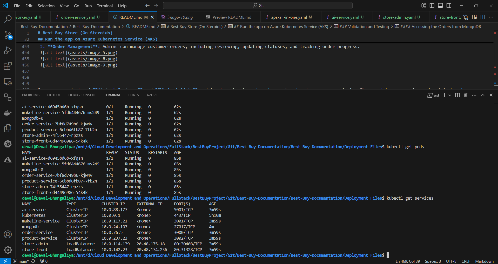

### Step 6: Deploy Virtual Customer and Worker
   ```bash
   kubectl apply -f admin-tasks.yaml
   ```
- Monitor Virtual Customer:
   ```bash
   kubectl logs -f deployment/virtual-customer
   ```
   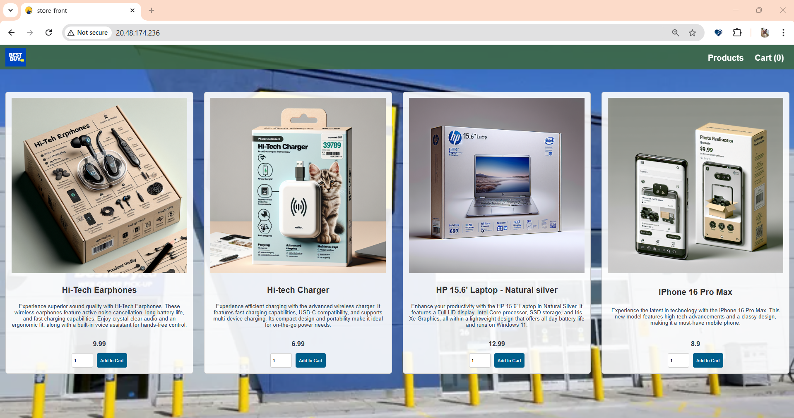
- Monitor Virtual Worker:
   ```bash
   kubectl logs -f deployment/virtual-worker
   ```
   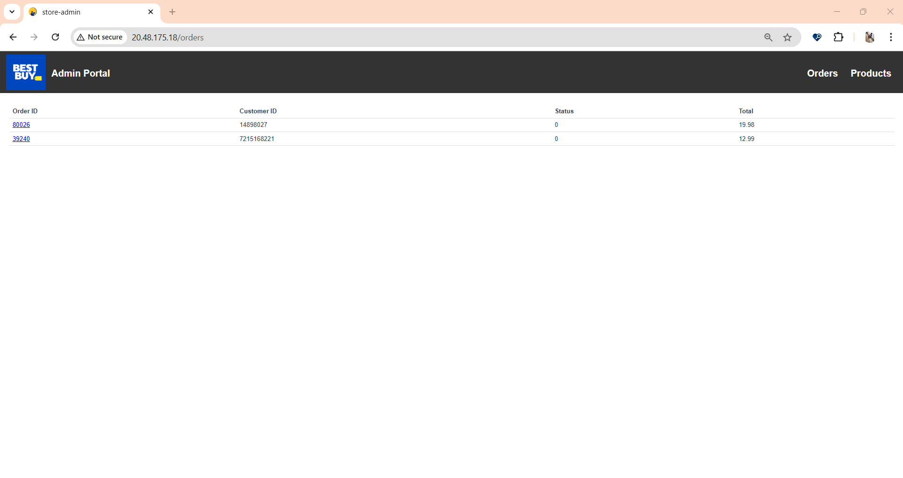

### Step 7: Scale and Monitor Services
### Scale Deployments:
- Scale the `order-service` to 3 replicas:
```bash
kubectl scale deployment order-service --replicas=3
```
- Check Scaling:
```bash
kubectl get pods
```
- Monitor Resource Usage:

   - Enable metrics server for resource monitoring.
   - Use kubectl top to monitor pod and node usage:
   ```bash
   kubectl top pods
   kubectl top nodes
   ```

### Step 8: Explore Advanced Features
#### AI-Generated Descriptions and Images:
- Use the AI Service for generating product descriptions and images.
- Ensure your OpenAI API key is correctly configured in the deployed secret.
#### RabbitMQ Management:
- Access the RabbitMQ management UI:
   ```bash
   kubectl port-forward service/rabbitmq 15672:15672
   ```
   The kubectl port-forward command is used to forward a local port to a port on a Kubernetes resource (e.g., a Pod or Service). This allows you to access the application running in the cluster from your local machine without exposing it externally.


- Login with the default credentials (`username`/`password`).

#### MongoDB Shell Access and Database Exploration
In this section, you will use the MongoDB shell to interact with the `orderdb` database, which stores order information for the Algonquin Pet Store application. Follow the steps below to connect to the MongoDB pod and explore its contents.

##### **1- Access the MongoDB Shell**
Run the following command to connect to the MongoDB shell inside the running MongoDB pod:
```bash
kubectl exec -it <mongodb-pod-name> -- mongo
```
Explanation: This command uses kubectl exec to open an interactive shell (-it) inside the MongoDB pod and starts the MongoDB shell program (mongo).

##### **2- List All Databases**
Once inside the MongoDB shell, run:
```bash
show dbs
```
Explanation: The show dbs command lists all databases available on the MongoDB server. You should see a list that includes the orderdb, which stores order-related data for the application.
##### **3- Switch to the Order Database**
```bash
use orderdb
```
Explanation: The use orderdb command selects the orderdb database, making it the active database for subsequent queries and commands.
##### **4- List Collections in the Database**
Display all collections in the orderdb database:
```bash
show collections
```
Explanation: The show collections command lists all collections (similar to tables in relational databases) in the current database. The orders collection contains the order data.
##### **5- Query the Orders Collection**
Retrieve all documents in the orders collection:
```bash
db.orders.find()
```
Explanation: The db.orders.find() command fetches and displays all documents (records) in the orders collection. This allows you to view the stored order data, including details such as customer information, products, and order status.

#### By following these steps, you will:
- Connect to the MongoDB shell in the Kubernetes pod.
- Explore the databases and collections used by the application.
- Query the orders collection to examine the data structure and stored records.


### Validation and Testing

After successfully deploying the application using either the all-in-one YAML file or individual YAML files, and ensuring that the Pods are in a ready state, you can validate the deployment. Retrieve the service URLs by running the command `kubectl get services`.

Access the front-end of the application by entering the `External-IP` for the `store-front` and `store-admin` services in a web browser:

- **Store-front**: This front-end interface allows users to browse products on the website, add items to their cart, and place orders seamlessly with full functionality.


  **Cart Section:** This section displays the items users have added to their cart, showing details like item names, quantities, prices, and the total amount. Users can modify their cart by removing items before proceeding to checkout.
  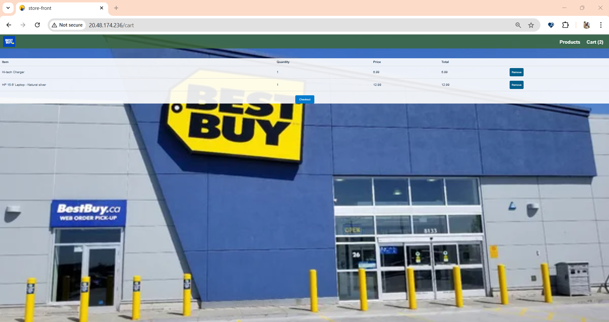

  **After Checkout:** Once the order is placed, a confirmation message is displayed to the user, ensuring that the order was successfully submitted.
  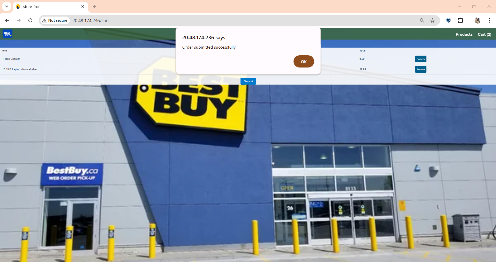


- **Store-admin**: This front-end interface allows the admin user to perform two primary operations:


  1. **CRUD Operations on Products**: Admins can create, update, view, and delete products. Once a product is created and saved, it will automatically appear on the **Store-front**, allowing customers to view and place orders for the newly added product. Additionally, we integrated AI technologies to enhance the product management experience:
     - **ChatGPT-4**: Used for generating detailed product descriptions based on the product name and keywords provided by the admin. This ensures consistent and high-quality descriptions for all products.
     - **DALL-E 3**: Deployed for generating product images. Once the description is generated by ChatGPT-4, it is passed to DALL-E 3 to create a relevant and visually appealing product image.
     

  Example of the **Product Creation Page**:
  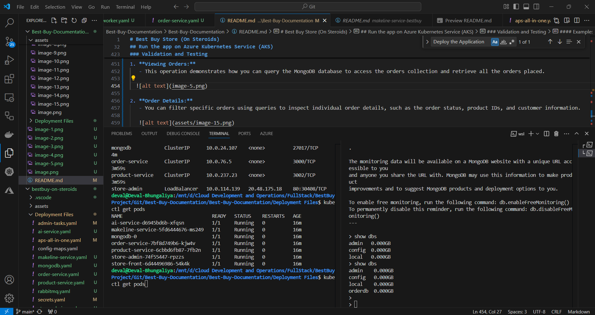
  
  **Store Front Procuct List**
   

 2. **Order Management**: Admins can manage customer orders, including reviewing, updating statuses, and tracking order progress.
 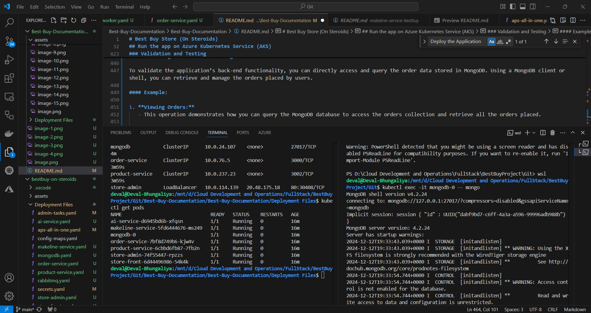
 
 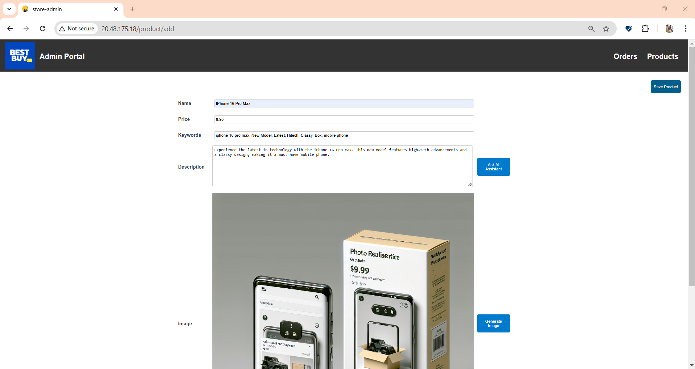


Moreover, we deployed **Virtual Customer** and **Virtual Admin** modules to automate order placement and order processing tasks. These modules are configured and deployed using a separate YAML file, enabling end-to-end automation of these functionalities.

- **Virtual Customer**: Tasks are defined to place up to 200 orders per hour automatically.
- **Virtual Admin**: Tasks involve managing and processing up to 50 orders per hour, ensuring efficient handling of high-order volumes.
- **Automated System**: Deploying this system enables the automation of order placement and completion processes, ensuring efficiency and scalability.
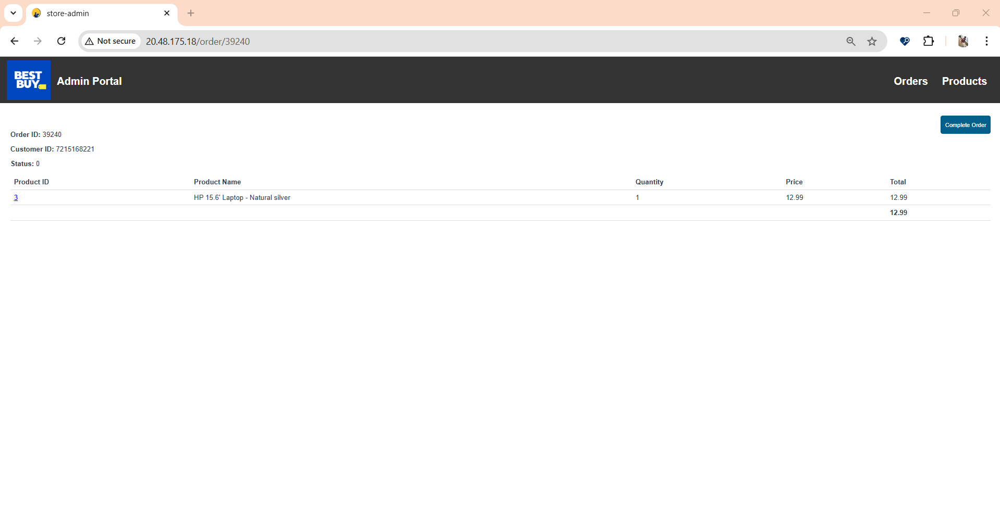


#### Accessing the Orders from MongoDB

To validate the application’s back-end functionality, you can directly access and query the order data stored in MongoDB. Using a MongoDB client or shell, you can retrieve and manage the orders placed by users.

#### Example:

1. **Viewing Orders:**
   - This operation demonstrates how you can query the MongoDB database to access the orders collection and retrieve all the orders placed.

   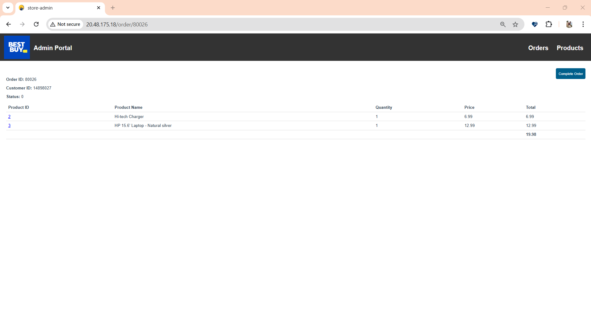

2. **Order Details:**
   - You can filter specific orders using queries to inspect individual order details, such as the order status, product IDs, and customer information.

   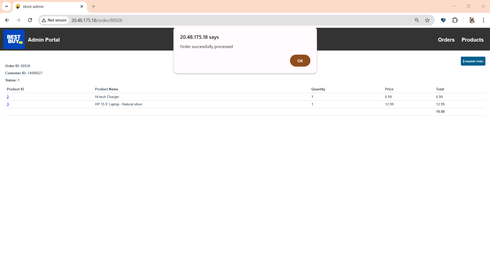

This capability provides direct visibility into the order data, ensuring that the application functions as intended and allows for debugging or analytics purposes.


### Demo Video

A demo video showcasing the deployment, functionality, and features of the application is available [here](https://example.com/demo).